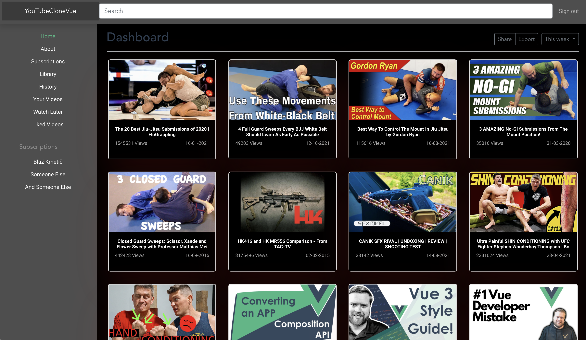

# Youtube-clone-vue

## Clone of youtube page, made with vue.js

Tech and concepts that I used:

- HTML
- CSS
- Figma
- Bootstrap
- Animate css
- Vuex
- Vue-router
- Media Queries
- REST API



## Project setup

```
npm install
```

### Compiles and hot-reloads for development

```
npm run serve
```

### Compiles and minifies for production

```
npm run build
```

### Customize configuration

See [Configuration Reference](https://cli.vuejs.org/config/).
